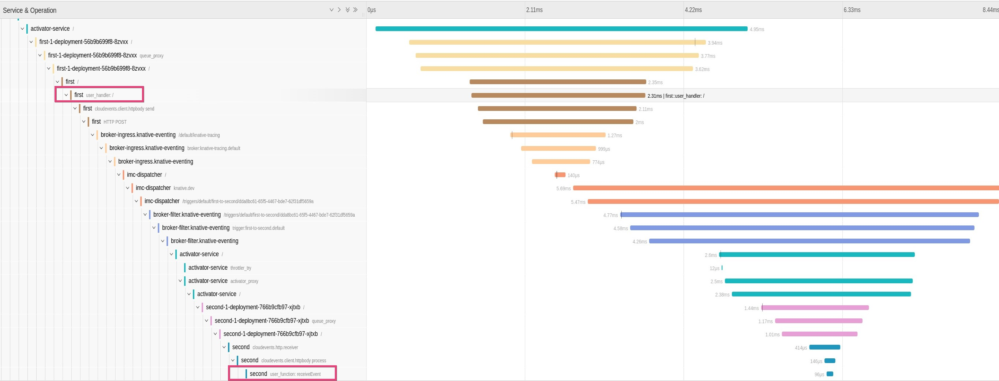
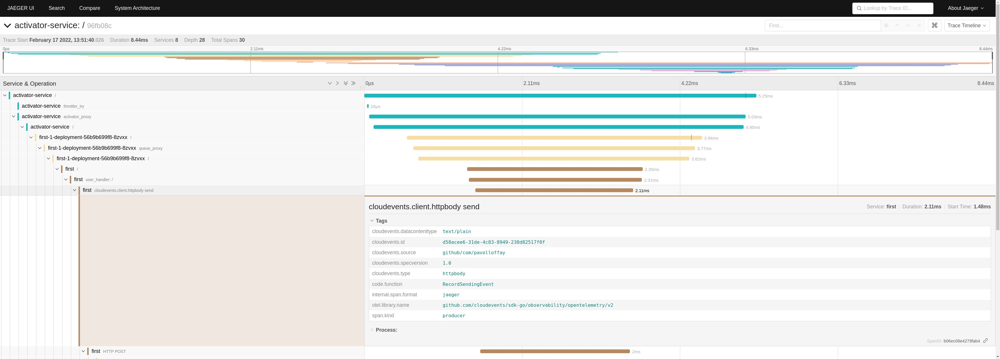
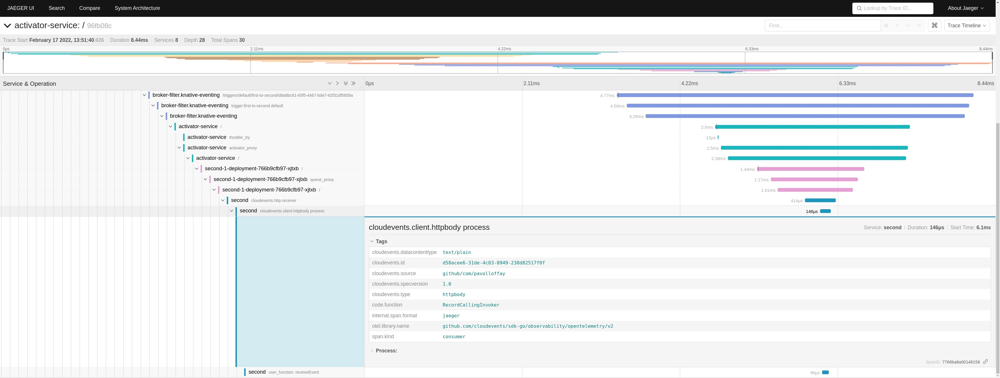

# Knative distributed tracing

This is a personal project to explore distributed tracing in [knative](https://knative.dev/).

The project shows that knative provides out-of-the-box distributed tracing capabilities (it starts trace and create spans for service/function invocation), but the project also provides instrumentation for Knative eventing client library (Cloudevents) to ensure in-process context propagation (from in-bound to out-bound request/event).

This project implements two services: `first` and `second`. The first service exposes HTTP API on port `8090` and it emits CloudEvent when the API is accessed. The second service consumes this event.

#### How does distributed tracing work in Knative

The Knative data-plane (e.g. activator, controller, queue-proxy) are instrumented with distributed tracing API. These components create tracing data for every transaction (request, event). The trace-context (trace IDs) are not added to the event metadata (e.g. as extension) but are propagated in e.g. in HTTP headers.

The user function/service is however responsible to propagate the headers from in-bound to out-bound event/request. This might not always apply all scenarios (e.g. if events are routed only by control plane).

### Output

Following trace shows end-to-end transaction:





* Spans from service `first` are created from application tracer
* Spans from service `second` are created from application tracer
* The spans in red column are "application"/"business logic" spans created explicitly in the services.
* see [raw trace JSON](./assets/jaeger-trace-96fb08cdf0962dc11e32043925f9b46c.json)

The stdout output from the `first` service shows that the incoming request already contains tracing headers - B3 and W3C Trace-Context. The B3 protocol is there probably for compatibility reasons, to make sure older applications instrumented with e.g. Zipkin libraries are able to propagate the context:
```bash
2022/02/17 12:53:48 Request headers:
2022/02/17 12:53:48 	X-B3-Sampled: [1]
2022/02/17 12:53:48 	X-B3-Spanid: [af6c239eb7b39349]
2022/02/17 12:53:48 	X-B3-Traceid: [5f2c4775e0e36efc1d554a0b6c456cc1]
2022/02/17 12:53:48 	X-Forwarded-For: [10.244.0.12, 10.244.0.5]
2022/02/17 12:53:48 	Accept-Language: [en,fr;q=0.9,de;q=0.8,sk;q=0.7]
2022/02/17 12:53:48 	Cookie: [_ga=GA1.2.260863911.1644918876]
2022/02/17 12:53:48 	Accept: [text/html,application/xhtml+xml,application/xml;q=0.9,image/avif,image/webp,image/apng,*/*;q=0.8,application/signed-exchange;v=b3;q=0.9]
2022/02/17 12:53:48 	K-Proxy-Request: [activator]
2022/02/17 12:53:48 	Upgrade-Insecure-Requests: [1]
2022/02/17 12:53:48 	User-Agent: [Mozilla/5.0 (X11; Fedora; Linux x86_64) AppleWebKit/537.36 (KHTML, like Gecko) Chrome/98.0.4758.80 Safari/537.36]
2022/02/17 12:53:48 	X-Request-Id: [ee2797b5-1ee9-408e-b1ff-d5e5431977e6]
2022/02/17 12:53:48 	Cache-Control: [max-age=0]
2022/02/17 12:53:48 	X-Forwarded-Proto: [http]
2022/02/17 12:53:48 	Traceparent: [00-5f2c4775e0e36efc1d554a0b6c456cc1-af6c239eb7b39349-01]
2022/02/17 12:53:48 	Accept-Encoding: [gzip, deflate]
2022/02/17 12:53:48 	Forwarded: [for=10.244.0.12;proto=http]
2022/02/17 12:53:48 Response headers:
2022/02/17 12:53:48 	Traceparent: [00-5f2c4775e0e36efc1d554a0b6c456cc1-1cf3f827eba96bf2-01]
2022/02/17 12:53:48
```

The stdout from the `second` service shows that the incoming event does not contain trace-context (trace IDs). The trace-context is only in the HTTP headers like we saw in the stdout from the `first` service.
```bash
2022/02/17 13:39:36 Event received: Context Attributes,
  specversion: 1.0
  type: httpbody
  source: github/com/pavolloffay
  id: fad4139c-b3fb-48b2-b0f4-fee44addc5f1
  time: 2022-02-17T13:39:34.426355726Z
  datacontenttype: text/plain
Extensions,
  knativearrivaltime: 2022-02-17T13:39:34.491325425Z
Data,
  hello from first, traceid=84da42ff2a26bda453330b23dde1a898
```

## Prerequisites

Follow the [quickstart](https://knative.dev/docs/getting-started/quickstart-install/) to install `kn`, quickstart plugin and kind with installed knative.

Install Jaeger:
```bash
kubectl apply -f deploy/01-jaeger.yaml
```

Enable distributed tracing in Knative Eventing and Service: 
* https://knative.dev/docs/eventing/accessing-traces/
* https://knative.dev/docs/serving/accessing-traces/

Set the `data.sampling-rate` to `1` and `data.zipkin-endpoint` to `http://jaeger-collector.jaeger.svc.cluster.local:9411/api/v2/spans`

## Build and deploy

```bash
make docker docker-push deploy
```

Now open browser http://first.default.127.0.0.1.sslip.io/

Open Jaeger UI `kubectl port-forward service/jaeger-query 16686:16686 -n jaeger`

## References

* Knative distributed tracing eventing docs: https://knative.dev/docs/eventing/accessing-traces/
* Knative distributed tracing serving docs: https://knative.dev/docs/serving/accessing-traces/
* Knative distributed tracing blog post https://knative.dev/blog/articles/distributed-tracing/
* Knative eventing/Cloudevents Golang client instrumentation: https://github.com/cloudevents/sdk-go/tree/main/observability/opentelemetry/v2
